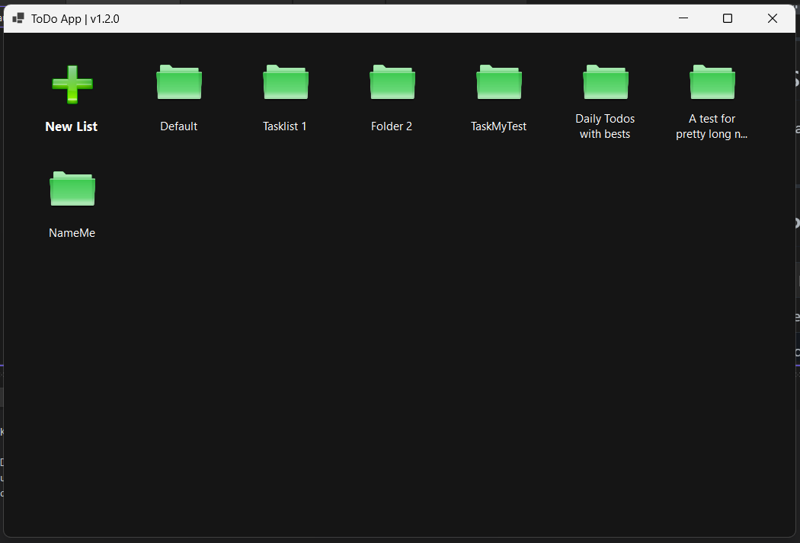
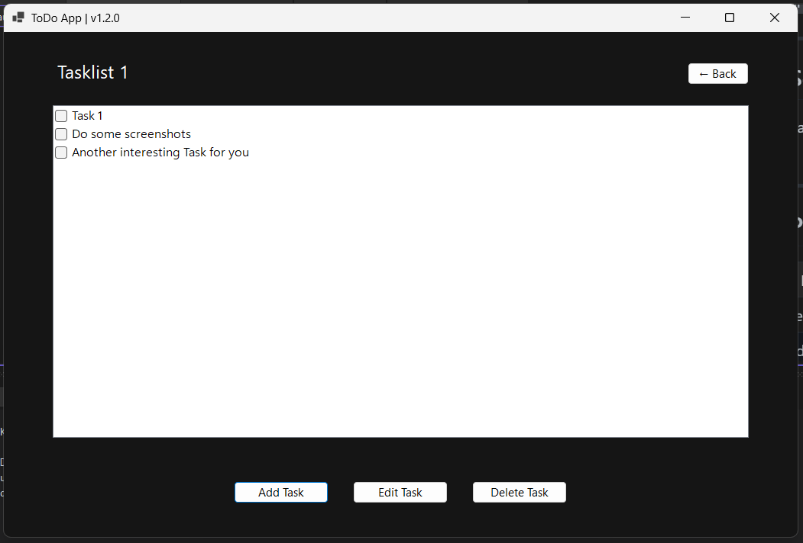

# ✅ ToDoApp MVP

A minimal yet functional **To-Do List desktop app** built in **C# WinForms**, using a custom UI with `CheckedListBox` for tasks, *icon + label* cards for groups, and local **SQLite** database. Lightweight, fast, and fully self-contained — no .NET installation needed!


---

## ✨ Features

- ✔️ Add new tasks
- 🔄 Rename tasks
- ✅ Mark tasks as done (with checkboxes!)
- ❌ Delete completed tasks
- 🗂 Organize tasks by groups
- 🧩 Modern card-based group UI
- 🔄 Rename & delete groups via context menu
- 📋 Local data persistence with SQLite
- 💬 Custom input prompt dialogs
- 🚀 Fully self-contained Windows app

---

## 🖥 Preview (v1.2.0)

### Group View


### Task View


---

## 📦 Technologies Used

- C# (.NET 6 or later)
- WinForms (Windows Forms)
- SQLite
- Visual Studio

---

## 🛠 How to Run

### For Developers:

1. Clone the repo:
	```bash
	git clone https://github.com/LostSpaceNG/ToDoApp.git
	```
2. Open the .sln file in Visual Studio
3. Build & run the project (F5)
4. Use the app 🎉

### For Users:

1. Download the self-contained .exe release
2. No installation or .NET Runtime required
3. Just run ToDoApp.exe

---

## 📈 Version History

See full changelog in [📄 CHANGELOG.md](./CHANGELOG.md)

---

## 💡 Future Ideas

- Set due dates & reminders
- Save to cloud or sync across devices
- Light/Dark mode themes
- Search feature
- Area for additional notes
- UI Refinements

---

## 📄 License

MIT License — feel free to use, learn from, or improve this project.

---

## 🙋‍♂️ Author

Made with love by *`Spaced Out`* — a C# developer learning in public.

GitHub: [LostSpaceNG](https://github.com/LostSpaceNG)

---

## 📘 [Development Process Documentation](./DEVDOC.md)